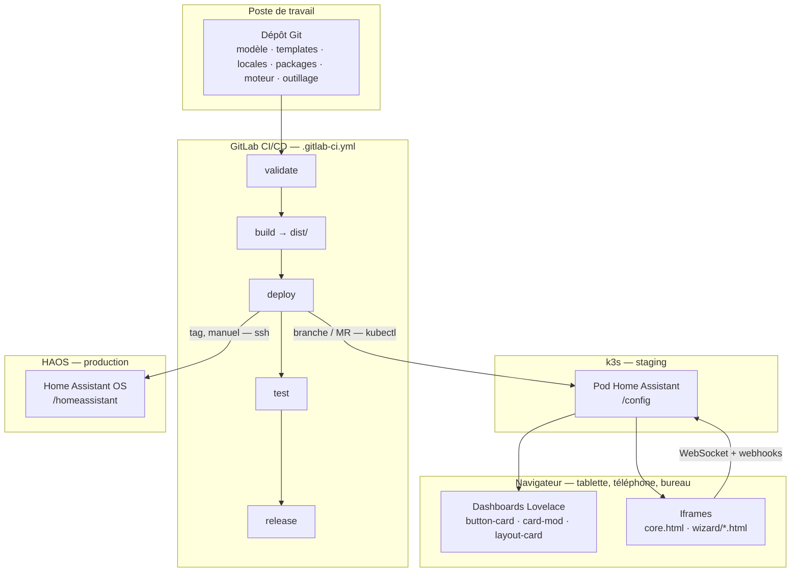
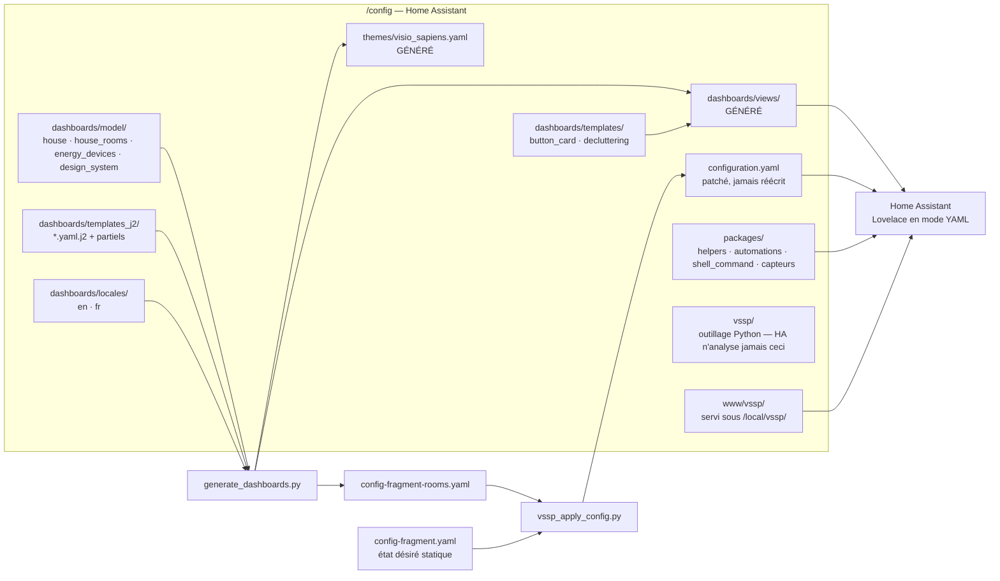
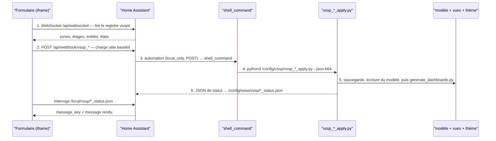
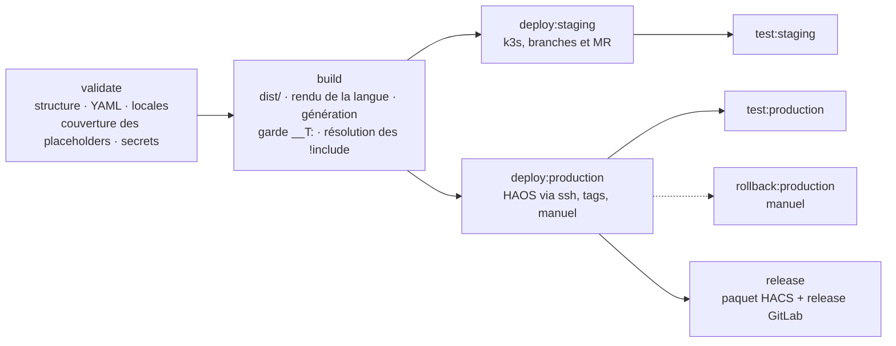

# Visio Sapiens — vision et architecture

[English](Vision.md) · **Français**

Un OS domotique doté d'une interface futuriste comparable à un centre de
contrôle. Home Assistant est ramené au rang de moteur de données ;
l'intégralité de l'interface est pilotée par Visio Sapiens.

Les dashboards sont **générés, jamais écrits à la main**. On décrit la
maison une fois dans une console d'administration — langue, format, pièces,
placement des appareils, charte graphique — et chaque dashboard, la barre de
navigation, le thème et les entrées de `configuration.yaml` qui les
déclarent sont rendus à partir de cette seule description, puis maintenus en
phase à mesure que la maison change.

Ce document est la carte du système entier : quelles sont les pièces, par
quel chemin une modification voyage d'un formulaire jusqu'à un dashboard
rendu, et quel état vit où. Chaque domaine a son document détaillé — voir
[l'ordre de lecture](#ordre-de-lecture) à la fin.

---

## 1. Les cinq invariants

Tout ce qui suit en découle. Casser l'un d'eux et le système cesse d'être
cohérent.

| # | Invariant | Conséquence |
|---|---|---|
| 1 | **Le modèle EST l'interface.** `dashboards/model/house.yaml` est l'unique source de vérité pour les pièces, les tableaux, le format et la langue. | Aucun dashboard n'est maintenu à la main. Ajouter une pièce est une modification du modèle, pas du YAML. |
| 2 | **Les fichiers générés sont des sorties.** Tout ce qui est dans `dashboards/views/`, `config-fragment-rooms.yaml` et `themes/visio_sapiens.yaml` est rendu. | Y toucher est perdu à la génération suivante — et chaque bouton de la console génère. |
| 3 | **L'anglais est la source de vérité des chaînes.** `locales/en.yaml` est le contrat ; les autres langues sont des surcouches fusionnées par-dessus. | Une clé manquante retombe sur l'anglais au lieu d'afficher du vide. Les identifiants ne sont jamais traduits. |
| 4 | **Le dépôt n'est pas l'état vivant.** Les pièces, les appareils découverts et la charte appliquée sont écrits sur l'instance, par la console. | Le dépôt livre une liste `rooms:` vide, à dessein. Le déploiement *préserve* l'état vivant au lieu de l'écraser. |
| 5 | **Tout ce qu'un dashboard référence vit dans `packages/`.** Home Assistant charge `packages/` ; il ne lit jamais `vssp/`. | Un helper, une automation ou un `shell_command` déclaré dans `vssp/` est inerte. `vssp/` contient des exécutables, rien que HA n'analyse. |

---

## 2. Vue d'ensemble

Cinq endroits détiennent quelque chose, et ils ne sont pas interchangeables.



Les deux cibles de déploiement font tourner **le même paquet** : le build
produit une seule archive `dist/`, et les deux jobs de déploiement la
déballent, régénèrent sur la cible et patchent `configuration.yaml` avec le
même outillage Python. Seul le transport diffère — `kubectl exec` sur k3s,
`ssh` sur HAOS.

---

## 3. À l'intérieur de l'instance

Ce que le déploiement installe réellement, et qui lit quoi.



**`vssp/` ce sont des exécutables, `packages/` c'est de la configuration.**
Home Assistant charge `packages/` via `homeassistant: packages:
!include_dir_named packages` et analyse chacun de ses fichiers. Il ne
regarde jamais dans `vssp/`, qui contient le Python que les `shell_command`
de `packages/` appellent. `vssp/vssp_admin_config.yaml` est une copie
résiduelle des helpers admin, inerte pour cette raison — les vrais sont dans
`packages/vssp_admin.yaml`.

---

## 4. La chaîne de génération

Une seule commande rend tout. Chaque bouton de la console en est une
variante.

```
house.yaml + house_rooms.yaml + energy_devices.yaml + design_system.yaml
      + locales/<code>.yaml
      + templates_j2/*.yaml.j2
                    │
                    ▼
      generate_dashboards.py
                    │
      ┌─────────────┼──────────────────────┬────────────────────┐
      ▼             ▼                      ▼                    ▼
dashboards/     themes/            config-fragment-      JSON de statut
views/*.yaml    visio_sapiens.yaml rooms.yaml            dans www/vssp/
                                          │
                                          ▼
                              vssp_apply_config.py  →  configuration.yaml
```

Quatre propriétés rendent l'opération sûre depuis un bouton, dans une maison
en service :

- **Validé avant écriture.** Le rendu est analysé en YAML — les tags HA
  (`!include`, `!secret`) tolérés — *avant* que le fichier cible ne soit
  écrasé. Un template cassé n'atteint jamais un dashboard déployé.
- **Idempotent.** Régénérer une maison existante rafraîchit ses dashboards
  au lieu de les dupliquer.
- **Sauvegardé.** Chaque application écrit d'abord une copie horodatée ;
  `vssp_prune_backups.py` en assure la rotation.
- **Additif sur `configuration.yaml`.** `vssp_apply_config.py` ne fusionne
  que les clés que Visio Sapiens possède — préfixées `visio-sapiens` /
  `vssp_` — et préserve les clés tierces, l'ordre, les commentaires et les
  tags `!include`. `--prune-dashboards` retire les dashboards de pièce qui
  n'existent plus, et rien d'autre.

---

## 5. La console d'administration

Le dashboard `ADMIN` est l'unique porte d'entrée pour créer et maintenir la
maison. Son menu est un hub de sous-vues : neuf écrans, chacun masqué de la
barre d'onglets, accessibles uniquement depuis le menu.

| Écran | Ce qu'il décide | Ce qu'il écrit |
|---|---|---|
| PIÈCES & ÉTAGES | les pièces de la maison et leurs étages | `house.yaml` `rooms:`, registre Zones/Étages HA |
| APPAREILS DÉTECTÉS | quels appareils découverts sont réels | `report.json`, `house_rooms.yaml` |
| ASSIGNATION | chaque appareil → une pièce **et** un tableau | `house.yaml` `slots:` |
| APPAREILS ÉNERGIE | le parc mesuré et le tableau électrique | `energy_devices.yaml` |
| GOOGLE CALENDAR | l'intégration Google et l'agenda du bandeau | identifiants d'application HA, `house.yaml` |
| CHARTE GRAPHIQUE | les tokens de design | `design_system.yaml` → `themes/visio_sapiens.yaml` |
| DASHBOARDS | lister, régénérer, supprimer les dashboards générés | `views/`, `config-fragment-rooms.yaml` |
| MISES À JOUR | système, HACS et firmware, séparés | entités `update.*` de HA |
| COFFRE-FORT | secrets d'accès serveur, comptes, mots de passe | HashiCorp Vault |

Chaque écran qui soumet des données suit **la même boucle en six temps**.
Apprise une fois, elle rend tous les formulaires de la console lisibles.



Trois détails de cette boucle sont porteurs :

- **Le formulaire est une iframe servie par Home Assistant lui-même.** Même
  origine que le dashboard, et un sandbox qui porte `allow-same-origin` : les
  pages qui parlent au WebSocket (PIÈCES & ÉTAGES, APPAREILS DÉTECTÉS — et
  CORE) empruntent la session de la tablette via le `hass.auth` du dashboard
  parent, un jeton court que Home Assistant rafraîchit. Aucun jeton longue
  durée n'est plus demandé ; on peut encore en coller un, seulement pour une
  page ouverte seule, hors d'un dashboard. Pour le reste, le dashboard parent
  ne passe à l'iframe que ce qu'elle ne peut pas déduire — la langue, et, pour
  le popup de planification, la liste d'entités du tableau.
- **La charge utile est en base64.** Couleurs, valeurs `rgba()` et texte
  libre casseraient sinon le quoting shell sur le chemin vers Python.
- **Le fichier de statut porte une `message_key` *et* un message rendu.**
  L'iframe connaît la langue par son paramètre `?lang=` et peut donc
  traduire la clé elle-même ; la chaîne rendue est le repli. Un jeton
  machine n'est jamais traduit.

Deux écrans lisent au lieu d'écrire : APPAREILS DÉTECTÉS lance le scan en
lecture seule `vssp_discovery.py`, et COFFRE-FORT parle à Vault directement
depuis le navigateur.

---

## 6. Les dashboards

### La famille

| Dashboard | Rôle | Template |
|---|---|---|
| `HOME` | point d'entrée, HUD, radar central, carte de chat | `home.yaml.j2` |
| `CORE` | supervision système — une iframe vers `core.html` | `core.yaml.j2` |
| `ENERGY` | production, consommation, tableau électrique | `energy.yaml.j2` |
| `ADMIN` | la console elle-même | `admin.yaml.j2` |
| un par pièce | six tableaux sur une grille fixe | `room.yaml.j2` |

Les quatre dashboards système existent dès la création de la maison, quelles
que soient les pièces déclarées. Chaque template a un jumeau
`*_mobile.yaml.j2` : le format est un choix fait à la génération, pas une
media query au runtime.

### Les parties partagées

Chaque dashboard — système comme pièce — est assemblé à partir des mêmes
partiels, si bien qu'une modification atterrit partout d'un coup :

| Partiel | Ce qu'il dessine |
|---|---|
| `_header.j2` / `_header_mobile.j2` | le bandeau : nom du dashboard, météo, date, heure, agenda |
| `_nav.j2` / `_nav_mobile.j2` | la barre de navigation : 4 entrées système **+ une par pièce déclarée** |
| `_switch_group.j2` | la liste d'interrupteurs d'un tableau |
| `_slot_schedule.j2` | l'horloge du panneau INTERRUPTEURS, qui ouvre le popup de planification |

La barre n'est jamais maintenue à la main. Sa longueur vaut toujours
`4 + pièces déclarées`, et ajouter une salle de bain dans la console ajoute
son entrée à tous les dashboards en même temps.

### Les tableaux d'une pièce

Une pièce dispose d'un **nombre fixe de panneaux**, afin que la grille du
HUD soit dessinée une fois et jamais déformée par une pièce contenant plus
d'appareils qu'une autre : `climate`, `lights`, `appliances`, `shutters`,
`security`, `audio`.

L'identifiant de tableau est normalisé — la même chaîne sert de clé dans
`house.yaml`, de `grid-area` CSS et de nom de section dans le template. Il
n'est jamais traduit ; seul son libellé l'est, via `slot.*`. Deux jeux
réduits (`toilet`, `garden`) disent quels tableaux sont *candidats* sans
dupliquer le template. Un tableau hors du jeu se replie et ses voisins
s'étendent ; un tableau du jeu mais vide le dit — des WC n'auront jamais de
volets, alors qu'un salon peut simplement ne pas les avoir encore intégrés.

### La pile de rendu

```
YAML Lovelace (généré)
  └─ templates button-card (vssp_*)  ← templates/button_card_templates.yaml
       └─ CSS card-mod
            └─ tokens du thème       ← themes/visio_sapiens.yaml (généré)
                 └─ moteurs CSS/JS   ← /local/vssp/css/vssp.css, js/vssp.js
                      └─ composants web + iframes
```

La règle : aucune carte Lovelace classique dans les dashboards, sauf
exceptions délibérées — `logbook` et `iframe`, plus `tile`, `entities` et
`markdown` dans la seule console d'administration. Quelques cartes
communautaires spécialisées font ce que le moteur ne réécrit pas :
`apexcharts-card` (graphiques), `dynamic-weather-card` et
`simple-weather-card` (météo), `calendar-card-pro` (agenda).
`button_card_templates.yaml` et `decluttering_templates.yaml` sont lus tels
quels par Home Assistant via `!include`, donc `t()` **n'y fonctionne pas** —
le texte affiché doit arriver déjà traduit du dashboard appelant.

---

## 7. La langue

La langue est choisie une fois, à la génération, jamais au runtime.

| Où | Ce que cela pose |
|---|---|
| Sélecteur de langue de la console | écrit `locale:` dans `house.yaml` |
| `generate_dashboards.py` | rend les templates avec ce catalogue |
| Variable CI `VSSP_LOCALE` | rend `config-fragment.yaml` au build |

Trois consommateurs, un catalogue :

| Consommateur | Syntaxe |
|---|---|
| Templates Jinja2 | `{{ t('room.bedroom') }}` |
| Fichiers plats — `config-fragment.yaml`, JS, CSS | `__T:dashboard.energy.title__` |
| Iframes de la console | `?lang=` dans l'URL, catalogue lu en JSON |

Deux règles empêchent de casser un dashboard qui marche : **l'état stocké
reste anglais** (les options d'`input_select` sont des identifiants comparés
en JavaScript — seul leur libellé est traduit), et **les dates viennent
d'`Intl`**, pas de tableaux traduits. Ajouter une langue consiste à déposer
une surcouche `<code>.yaml` dans `dashboards/locales/` — aucune modification
de code nulle part.

---

## 8. La charte graphique

L'écran CHARTE édite des tokens, pas du CSS. La chaîne reproduit exactement
celle de l'assignation, appliquée à l'identité visuelle :

```
Éditeur CHARTE (iframe)
   → webhook vssp_theme
      → vssp_theme_apply.py    → model/design_system.yaml
         → generate_dashboards.py --only theme
            → themes/visio_sapiens.yaml
               → tous les dashboards, à la frame suivante
```

`vssp_design_fields.py` est le vocabulaire partagé : une seule source de
vérité pour les noms de tokens à plat qu'utilisent le formulaire, la charge
utile du webhook et le fichier de statut, et pour la façon dont chacun
s'applique sur la structure imbriquée `design:`.
`design_system.default.yaml` est le réglage d'usine vers lequel l'éditeur
peut revenir.

---

## 9. Les sous-systèmes

| Sous-système | Où il vit | Ce qu'il fait |
|---|---|---|
| **Énergie** | `vssp_energy_sync.py`, `packages/vssp_energy_totaux.yaml`, `energy_devices.yaml` | maintient le parc mesuré, somme les capteurs `*_energie` en totaux maison, alimente le tableau électrique. `vssp_module_images.py` va chercher la photo produit d'un module nouvellement découvert. |
| **Planification** | `packages/vssp_schedule.yaml`, `vssp_schedule_apply.py`, `wizard/vssp_schedule.html` | l'horloge du panneau INTERRUPTEURS d'une pièce. Le popup écrit des règles récurrentes, ponctuelles et à minuterie dans `schedules.json` ; le package les exécute. |
| **Chatbot** | `packages/vssp_chatbot.yaml`, `vssp_chatbot_send.py`, `wizard/vssp_chatbot.html` | la carte de chat de HOME. Quatre fournisseurs (Gemini, Claude, ChatGPT, personnalisé) ; le fournisseur est lu depuis l'état propre du sélecteur, jamais depuis du texte client. |
| **Google Calendar** | `packages/vssp_google.yaml`, `vssp_google_setup.py` | fait depuis la console ce que HA demande normalement de faire à la main dans Paramètres → Appareils et services : identifiants d'application, puis l'intégration. |
| **Mises à jour** | `packages/vssp_updates.yaml`, `vssp_infra_updates.py` | regroupe chaque entité `update.*` en attente par famille — système, HACS, firmware — avec la politique de mise à jour automatique au même endroit. Une quatrième famille, **infrastructure**, n'a aucune entité derrière elle : une sonde lit l'hôte Ubuntu, k3s, GitLab, le runner et Vault en SSH, ses identifiants étant pris dans le coffre par le processus Python et non par Home Assistant. |
| **Coffre-fort** | `packages/vssp_vault.yaml`, `vault/`, `addons/vssp-vault/` | le coffre. Docker Compose sur l'hôte k3s, add-on Superviseur sur HAOS. **Le jeton de Home Assistant accorde `secret/metadata/*` et rien sur `secret/data/*`** : HA peut lister et décrire chaque entrée, et se voit refuser par Vault lui-même toute demande de valeur — car tout ce que HA lit finit en clair dans la base du recorder. Le navigateur, lui, lit les valeurs directement. |
| **Local technique / LAN** | `packages/vssp_technical_room.yaml`, `vssp_lan_probe.py` | sonde la Livebox et le switch, imprime du JSON sur stdout consommé par des capteurs `command_line`. Le mot de passe de la box est une variable CI masquée, écrite dans `/config/vssp/.livebox.env` au déploiement, jamais versionnée. |
| **CORE** | `www/vssp/core.html` | une page autonome, pas une vue Lovelace : elle appelle l'API REST de HA avec la session de la tablette, empruntée au dashboard qui l'entoure, et lit le JSON de stats k3s. Le dashboard CORE n'est qu'une iframe vers elle. |

---

## 10. L'état : qu'est-ce qui vit où

C'est la distinction qui prête le plus à confusion, elle mérite donc d'être
explicite.

| État | Dépôt | Instance | Préservé au déploiement |
|---|---|---|---|
| Templates, locales, packages, moteur, outillage | ✅ source | copie | remplacé |
| `house.yaml` — pièces et tableaux | livré **vide à dessein** | écrit par la console | ✅ `vssp_preserve_rooms.py` fusionne l'ancien dans le nouveau |
| `house_rooms.yaml`, `energy_devices.yaml`, `design_system.yaml` | absent / valeurs par défaut | écrit par la console | ✅ recopié depuis `dashboards.old` |
| `views/home.yaml`, `views/home_mobile.yaml` | généré | peut porter des retouches vivantes | ✅ recopié |
| `www/vssp/*.json`, `images/floorplan.svg`, `modules/` | absent | écrit au runtime | ✅ conservé si le paquet n'en livre pas |
| `report.json`, `assign_data.json` | jamais | sortie de scan | réécrit par le scan suivant |
| Secrets — Livebox, jetons HA, Vault | ❌ jamais | `.livebox.env`, `secrets.yaml`, Vault | injectés au déploiement |

Deux conséquences à retenir :

1. **Les pièces vivent dans le registre HA, pas dans le dépôt.** Un
   `house.yaml` sans pièces dans git est l'état voulu. Si les liens de pièce
   se mettent à renvoyer sur HOME, régénérer ne suffit pas — le fragment des
   pièces doit être fusionné dans `configuration.yaml`, puis Home Assistant
   redémarré.
2. **`dashboards/` est remplacé en bloc au déploiement**, contrairement à
   `vssp/` et `packages/` qui sont copiés en additif. C'est pourquoi le job
   met le `house.yaml` vivant de côté *avant* l'échange : un job qui meurt
   entre l'échange et l'étape de préservation laisserait sinon le
   déploiement *suivant* faire tourner la dernière bonne copie vers la
   corbeille.

---

## 11. CI/CD



Les deux jobs de déploiement exécutent la même séquence sur la cible :

1. déballer dans un répertoire de transit, mettre le `house.yaml` vivant de
   côté ;
2. échanger `dashboards/` et `themes/`, copier `vssp/` et `packages/` en
   additif, préserver l'état côté pod et les fichiers `www/` du runtime ;
3. échouer bruyamment si le paquet livre un fichier qu'aucune étape
   n'installe ;
4. `vssp_preserve_rooms.py` — fusionner les pièces vivantes dans le nouveau
   modèle ;
5. régénérer les dashboards, puis le thème, sur la cible elle-même ;
6. `vssp_apply_config.py` → `vssp_ensure_packages.py` →
   `vssp_ensure_secret.py` → `vssp_sanitize_resources.py` ;
7. `hass --script check_config`, **avec rollback automatique** de
   `dashboards/`, `themes/` et `configuration.yaml` en cas d'échec ;
8. redémarrer Home Assistant — appel REST d'abord, recréation du pod en
   repli.

Un déploiement **re-rend mais ne rescanne jamais** : le parc qu'il rend est
celui déjà enregistré sur l'instance. Prendre en compte du matériel
fraîchement branché suppose de lancer le scan et SYNC ENERGY depuis la
console.

Gardes à connaître : `validate` échoue si `VSSP_LOCALE` n'a pas de
catalogue, si `.livebox.env` a été versionné, ou si
`generate_dashboards.py` ne supporte pas une option qu'utilise le pipeline ;
`build` échoue sur tout placeholder `__T:` non substitué hors commentaire,
ou sur un fragment de pièces vide — les dashboards de pièce seraient
injoignables.

---

## 12. L'outillage Python

`vssp/` — tout ce qui s'y trouve est appelé par un `shell_command` de
`packages/`, ou par le pipeline. Home Assistant n'analyse jamais ce
répertoire.

### La chaîne de génération

| Script | Rôle |
|---|---|
| `generate_dashboards.py` | le générateur : modèle + langue + templates → vues, thème, fragment des pièces |
| `vssp_i18n.py` | moteur i18n — `load`, `render`, `dump`, `check` |
| `vssp_design_fields.py` | vocabulaire partagé des tokens de design |
| `vssp_apply_config.py` | patcher idempotent de `configuration.yaml` (ruamel) |
| `vssp_ensure_packages.py` | garantit `homeassistant: packages: !include_dir_named packages` |
| `vssp_ensure_secret.py` | garantit qu'une clé existe dans `secrets.yaml` — les noms, jamais les valeurs |
| `vssp_sanitize_resources.py` | déduplique `lovelace.resources` malgré les URL cache-bustées |
| `vssp_preserve_rooms.py` | fusionne les pièces vivantes dans le modèle déployé |

### Les applicateurs de la console

| Script | Appelé par | Écrit |
|---|---|---|
| `vssp_rooms_apply.py` | PIÈCES & ÉTAGES | `house.yaml` `rooms:` — ne touche jamais aux tableaux d'une pièce existante |
| `vssp_assign_prepare.py` | après chaque scan | `assign_data.json` — l'unique fichier que lit le formulaire d'assignation |
| `vssp_assign_apply.py` | ASSIGNATION | `house.yaml` `slots:` |
| `vssp_theme_apply.py` | CHARTE GRAPHIQUE | `design_system.yaml` |
| `vssp_energy_sync.py` | APPAREILS ÉNERGIE | `energy_devices.yaml` |
| `vssp_google_setup.py` | GOOGLE CALENDAR | identifiants d'application HA |
| `vssp_schedule_apply.py` | l'horloge INTERRUPTEURS | `schedules.json` |
| `vssp_chatbot_send.py` | la carte de chat de HOME | appel du fournisseur, `chatbot_status.json` |

### Sondes et maintenance

| Script | Rôle |
|---|---|
| `vssp_discovery.py` | scan en lecture seule de chaque entité par Zone → `report.json` |
| `vssp_lan_probe.py` | sonde Livebox + switch → JSON sur stdout |
| `vssp_infra_updates.py` | versions de l'hôte, k3s, GitLab, runner et Vault → la famille INFRASTRUCTURE |
| `vssp_module_images.py` | photo produit d'un module nouvellement découvert |
| `vssp_prune_backups.py` | rotation des sauvegardes horodatées écrites par chaque application |

### Non câblés

`build_template.py` (transforme un dashboard existant en `.j2` — l'outil
d'amorçage qui a produit `energy.yaml.j2`), `vssp_patch_dashboard.py` et
`vssp_save_svg.py` (calques de plan de maison, d'avant le générateur),
`vssp_selftest.py` (auto-diagnostic de la chaîne ENERGY, lancé à la main) et
`vssp_upgrade.py` (un stub de diff délibérément non destructif) sont des
outils de développement : aucun `shell_command` ni job CI ne les appelle.

---

## 13. Les packages Home Assistant

`home-assistant/packages/` — chargé en bloc par `!include_dir_named
packages`. Tout ce qu'un dashboard référence doit s'y trouver.

| Package | Fournit |
|---|---|
| `vssp_admin.yaml` | helpers, scripts et `shell_command` de la console, DISCOVERY / UPGRADE / DELETE |
| `vssp_generation.yaml` | sélecteurs de langue et de format, capteurs de langue déployée et de diagnostic |
| `vssp_rooms.yaml` | webhook PIÈCES & ÉTAGES, synchronisation du registre Zones |
| `vssp_assign.yaml` | webhook d'assignation, chaîne scan → prepare → apply |
| `vssp_theme.yaml` | webhook CHARTE, application de la charte |
| `vssp_schedule.yaml` | le moteur de planification derrière l'horloge INTERRUPTEURS |
| `vssp_chatbot.yaml` | webhooks du chatbot, sélecteur de fournisseur, endpoint personnalisé |
| `vssp_google.yaml` | webhook et configuration Google Calendar |
| `vssp_updates.yaml` | mises à jour en attente groupées par famille, politique automatique |
| `vssp_vault.yaml` | la moitié native du coffre — les noms seulement, jamais les valeurs |
| `vssp_energy_totaux.yaml` | totaux dynamiques d'énergie et de puissance |
| `vssp_home_status.yaml` | les capteurs du panneau KPI de HOME |
| `vssp_technical_room.yaml` | capteurs et sondes du local technique |
| `vssp_maintenance.yaml` | rotation des sauvegardes |

---

## 14. Arborescence du dépôt

```
.
├── .gitlab-ci.yml               validate / build / deploy / test / release
├── hacs.json  repository.yaml   distribution HACS
├── README.md  README.fr.md
│
├── docs/                        chaque document dans les deux langues (X.md / X.fr.md)
│   ├── dashboards/              l'interface et sa génération
│   ├── platform/                déploiement, Vault, sécurité, sauvegardes, MQTT
│   ├── ci-cd/                   le pipeline et ses postmortems
│   └── project/                 ce fichier, l'étude de cas, le plan de la série
│
├── themes/visio_sapiens.yaml    ← GÉNÉRÉ depuis design_system.yaml
│                                  (à la racine, imposé par HACS)
├── kubernetes/                  manifests k3s — RBAC, PVC, runner
├── deployment.yaml              le runner GitLab sur k3s
├── vault/                       Vault sur Docker : compose, config, policies
├── addons/vssp-vault/           le même coffre en add-on Superviseur HAOS
├── scripts/                     package · deploy · reload · validate
│
├── vssp/                        outillage Python — HA n'analyse jamais ceci
│
└── home-assistant/
    ├── config-fragment.yaml         état désiré des clés que possède Visio Sapiens
    ├── packages/                    tout ce qu'un dashboard référence
    ├── templates/                   button_card_templates · decluttering_templates
    ├── dashboards/
    │   ├── model/                   house · design_system (+ .default)
    │   ├── locales/                 en.yaml (le contrat) · fr.yaml (surcouche)
    │   ├── templates_j2/            un template par dashboard ET par format,
    │   │                            plus les partiels partagés
    │   ├── admin/                   la carte « dashboards système » de l'ADMIN
    │   └── views/                   ← GÉNÉRÉ — jamais édité à la main
    └── www/vssp/                    servi sous /local/vssp/
        ├── css/ js/ components/     les moteurs CSS et JS
        ├── wizard/                  les formulaires de la console, un HTML par écran
        ├── core.html                le dashboard système autonome
        └── backgrounds/ images/ modules/ movies/
```

Deux fichiers de modèle existent sur l'instance et pas ici, à dessein :
`dashboards/model/house_rooms.yaml` et `energy_devices.yaml` sont écrits par
la console, et `www/vssp/*.json` est le bus de statut entre les formulaires
et les applicateurs.

---

## Ordre de lecture

| Commencer par | Pour |
|---|---|
| [Dashboard_Generator](../dashboards/Dashboard_Generator.fr.md) | le générateur en détail : modèle, tableaux, grilles de pièce, langue |
| [Design_System_Editor](../dashboards/Design_System_Editor.fr.md) | l'écran CHARTE et les tokens qu'il édite |
| [Core_Dashboard](../dashboards/Core_Dashboard.fr.md) | `core.html`, de Glances à la page |
| [Scheduler](../dashboards/Scheduler.fr.md) · [Chatbot_Integration](../dashboards/Chatbot_Integration.fr.md) · [Google_Calendar](../dashboards/Google_Calendar.fr.md) · [Updates](../dashboards/Updates.fr.md) | un sous-système chacun |
| [Deployment](../platform/Deployment.fr.md) · [Vault](../platform/Vault.fr.md) · [Security](../platform/Security.fr.md) · [Backup_Retention](../platform/Backup_Retention.fr.md) | la fondation |
| [CI_CD](../ci-cd/CI_CD.fr.md) · [Troubleshooting](../ci-cd/Troubleshooting.fr.md) | le pipeline, et ce qui a cassé sur le terrain |
| [Integration_Case_Study](Integration_Case_Study.fr.md) | une fonctionnalité intégrée de bout en bout |
| [AI_Assistant](../dashboards/AI_Assistant.fr.md) | la couche suivante — **spécification, pas encore construite** |
