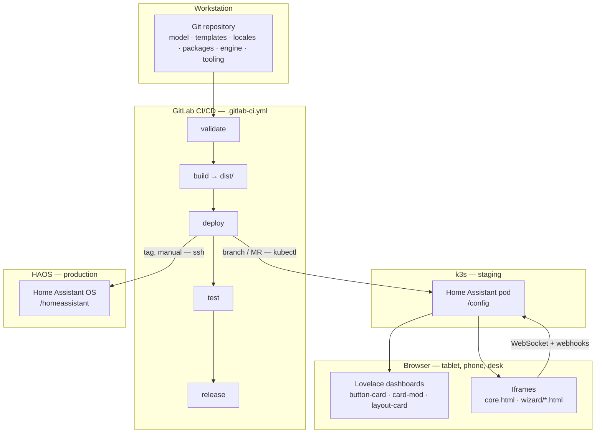
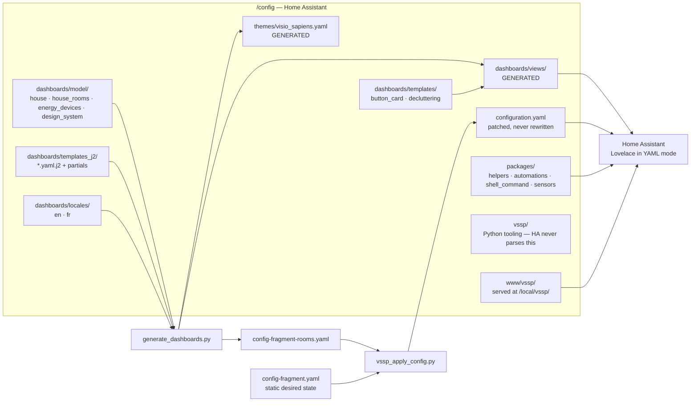
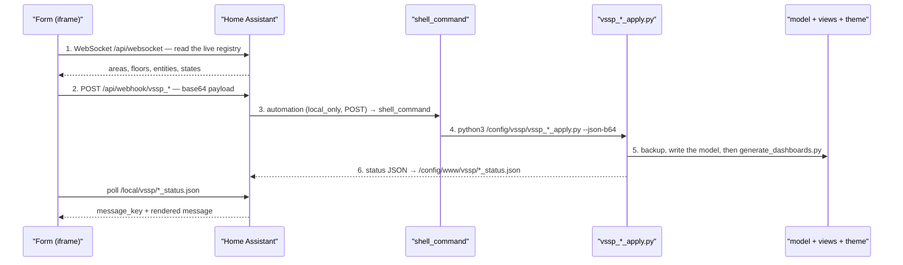
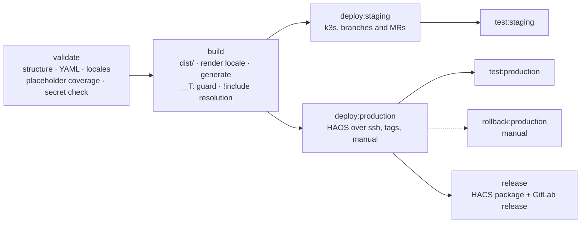

# Visio Sapiens — vision and architecture

**English** · [Français](Vision.fr.md)

A home-automation OS with a futuristic interface comparable to a control
centre. Home Assistant is reduced to a data engine; the entire interface is
driven by Visio Sapiens.

Dashboards are **generated, never hand-written**. You describe the home once
in an admin console — language, format, rooms, device placement, visual
charter — and every dashboard, the navigation rail, the theme and the
`configuration.yaml` entries that declare them are rendered from that single
description, then kept in sync as the home changes.

This document is the map of the whole system: what the pieces are, how a
change travels from a form to a rendered dashboard, and which state lives
where. Each area has its own detailed document — see
[the reading order](#reading-order) at the end.

---

## 1. The five invariants

Everything below is a consequence of these. Break one and the system stops
being coherent.

| # | Invariant | Consequence |
|---|---|---|
| 1 | **The model is the interface.** `dashboards/model/house.yaml` is the single source of truth for rooms, slots, format and locale. | No dashboard is maintained by hand. Adding a room is a model edit, not a YAML edit. |
| 2 | **Generated files are outputs.** Everything in `dashboards/views/`, `config-fragment-rooms.yaml` and `themes/visio_sapiens.yaml` is rendered. | Editing one is lost at the next generation — and every button in the console generates. |
| 3 | **English is the source of truth for strings.** `locales/en.yaml` is the contract; other languages are overlays merged on top of it. | A missing key falls back to English instead of rendering blank. Identifiers are never translated. |
| 4 | **The repository is not the live state.** Rooms, discovered devices and the applied design system are written on the instance, by the console. | The repository ships an empty `rooms:` list on purpose. Deployment *preserves* live state rather than overwriting it. |
| 5 | **Anything a dashboard references lives in `packages/`.** Home Assistant loads `packages/`; it never reads `vssp/`. | A helper, automation or `shell_command` declared in `vssp/` is inert. `vssp/` holds executables and nothing HA parses. |

---

## 2. System overview

Five places hold something, and they are not interchangeable.



The two deployment targets run the **same package**: the build produces one
`dist/` tarball, and both deploy jobs unpack it, regenerate on the target and
patch `configuration.yaml` with the same Python tooling. Only the transport
differs — `kubectl exec` on k3s, `ssh` on HAOS.

---

## 3. Inside the instance

What the deployment actually installs, and who reads what.



**`vssp/` is executables, `packages/` is configuration.** Home Assistant
loads `packages/` through `homeassistant: packages: !include_dir_named
packages` and parses every file in it. It never looks inside `vssp/`, which
holds the Python the `shell_command`s in `packages/` call.
`vssp/vssp_admin_config.yaml` is a leftover copy of the admin helpers and is
inert for that reason — the live ones are `packages/vssp_admin.yaml`.

---

## 4. The generation chain

One command renders everything. Every console button is a variation on it.

```
house.yaml + house_rooms.yaml + energy_devices.yaml + design_system.yaml
      + locales/<code>.yaml
      + templates_j2/*.yaml.j2
                    │
                    ▼
      generate_dashboards.py
                    │
      ┌─────────────┼──────────────────────┬────────────────────┐
      ▼             ▼                      ▼                    ▼
dashboards/     themes/            config-fragment-      status JSON in
views/*.yaml    visio_sapiens.yaml rooms.yaml            www/vssp/
                                          │
                                          ▼
                              vssp_apply_config.py  →  configuration.yaml
```

Four properties make this safe to run from a button in a live house:

- **Validated before writing.** The render is parsed as YAML — with the HA
  tags (`!include`, `!secret`) tolerated — *before* the target file is
  overwritten. A broken template never reaches a deployed dashboard.
- **Idempotent.** Regenerating an existing home refreshes its dashboards
  rather than duplicating them.
- **Backed up.** Every apply writes a timestamped copy first;
  `vssp_prune_backups.py` rotates them.
- **Additive on `configuration.yaml`.** `vssp_apply_config.py` merges only
  the keys Visio Sapiens owns — those prefixed `visio-sapiens` / `vssp_` —
  and preserves third-party keys, ordering, comments and `!include` tags.
  `--prune-dashboards` removes the room dashboards that no longer exist, and
  nothing else.

---

## 5. The admin console

The `ADMIN` dashboard is the only entry point for creating and maintaining
the home. Its menu is a subview hub: nine screens, each hidden from the tab
strip, reachable only from the menu.

| Screen | What it decides | Writes |
|---|---|---|
| ROOMS & FLOORS | the rooms of the home and their floors | `house.yaml` `rooms:`, HA Area/Floor registry |
| DETECTED DEVICES | which discovered devices are real | `report.json`, `house_rooms.yaml` |
| DEVICE ASSIGNMENT | each device → one room **and** one slot | `house.yaml` `slots:` |
| ENERGY DEVICES | the measured fleet and the breaker panel | `energy_devices.yaml` |
| GOOGLE CALENDAR | the Google integration and the header calendar | HA application credentials, `house.yaml` |
| GRAPHIC TEMPLATE | the design tokens | `design_system.yaml` → `themes/visio_sapiens.yaml` |
| DASHBOARDS | list, regenerate, delete generated dashboards | `views/`, `config-fragment-rooms.yaml` |
| UPDATES | system, HACS and firmware updates, split apart | HA `update.*` entities |
| SAFE | server secrets, accounts, application passwords | HashiCorp Vault |

Every screen that submits data follows the **same six-step loop**. Learn it
once and every form in the console is readable.



Three details of that loop are load-bearing:

- **The form is an iframe served by Home Assistant itself.** Same origin as
  the dashboard, and a sandbox carrying `allow-same-origin`: the pages that
  talk to the WebSocket (ROOMS & FLOORS, DETECTED DEVICES — and CORE) borrow
  the tablet's own session through the parent dashboard's `hass.auth`, a
  short-lived token Home Assistant refreshes. No long-lived token is asked
  for any more; one can still be pasted, only for a page opened on its own,
  outside a dashboard. Beyond that, the parent dashboard passes the iframe
  only what it cannot deduce — the language, and, for the scheduler popup,
  the entity list of the slot.
- **The payload is base64.** Colours, `rgba()` values and free text would
  otherwise break shell quoting on the way to Python.
- **The status file carries a `message_key` *and* a rendered message.** The
  iframe knows the language from its `?lang=` parameter, so it can translate
  the key itself; the rendered string is the fallback. A machine token is
  never translated.

Two screens read rather than write: DETECTED DEVICES runs the read-only
`vssp_discovery.py` scan, and SAFE talks to Vault directly from the browser.

---

## 6. The dashboards

### The family

| Dashboard | Role | Template |
|---|---|---|
| `HOME` | entry point, HUD, central radar, chat card | `home.yaml.j2` |
| `CORE` | system monitoring — an iframe onto `core.html` | `core.yaml.j2` |
| `ENERGY` | production, consumption, breaker panel | `energy.yaml.j2` |
| `ADMIN` | the console itself | `admin.yaml.j2` |
| one per room | six slots on a fixed grid | `room.yaml.j2` |

The four system dashboards exist the moment a home is created, whatever
rooms were declared. Each template has a `*_mobile.yaml.j2` sibling: the
format is a generation-time choice, not a runtime media query.

### The shared parts

Every dashboard — system and room alike — is assembled from the same
partials, so a change lands everywhere at once:

| Partial | What it draws |
|---|---|
| `_header.j2` / `_header_mobile.j2` | the band: dashboard name, weather, date, time, agenda |
| `_nav.j2` / `_nav_mobile.j2` | the navigation rail: 4 system entries **+ one per declared room** |
| `_switch_group.j2` | a slot's switch list |
| `_slot_schedule.j2` | the clock on a SWITCHES panel, opening the scheduler popup |

The rail is never maintained by hand. Its length is always
`4 + declared rooms`, and adding a bathroom in the console adds its entry to
every dashboard at once.

### Room slots

A room lays out a **fixed number of panels**, so the HUD grid is drawn once
and never deformed by a room holding more devices than another:
`climate`, `lights`, `appliances`, `shutters`, `security`, `audio`.

The slot id is normalised — the same string is the key in `house.yaml`, the
CSS `grid-area` and the section name in the template. It is never
translated; only its label is, through `slot.*`. Two reduced slot sets
(`toilet`, `garden`) say which slots are *candidates* without forking the
template. A slot outside the set collapses and its neighbours expand; a slot
inside it but empty says so — a toilet will never have shutters, whereas a
living room may simply not have integrated them yet.

### The rendering stack

```
Lovelace YAML (generated)
  └─ button-card templates (vssp_*)  ← templates/button_card_templates.yaml
       └─ card-mod CSS
            └─ theme tokens          ← themes/visio_sapiens.yaml (generated)
                 └─ CSS/JS engine    ← /local/vssp/css/vssp.css, js/vssp.js
                      └─ web components + iframes
```

The rule is: no classic Lovelace card in the dashboards except deliberate
exceptions — `logbook` and `iframe`, plus `tile`, `entities` and `markdown`
in the admin console only. A few specialised community cards do what the
engine does not rewrite: `apexcharts-card` (charts), `dynamic-weather-card`
and `simple-weather-card` (weather), `calendar-card-pro` (calendar).
`button_card_templates.yaml` and `decluttering_templates.yaml` are read
as-is by Home Assistant through `!include`, so `t()` does **not** work there
— displayed text must arrive already translated from the calling dashboard.

---

## 7. Language

The language is chosen once, at generation time, never at runtime.

| Where | What it sets |
|---|---|
| Console language selector | writes `locale:` into `house.yaml` |
| `generate_dashboards.py` | renders the templates with that catalogue |
| CI variable `VSSP_LOCALE` | renders `config-fragment.yaml` at build time |

Three consumers, one catalogue:

| Consumer | Syntax |
|---|---|
| Jinja2 templates | `{{ t('room.bedroom') }}` |
| Plain files — `config-fragment.yaml`, JS, CSS | `__T:dashboard.energy.title__` |
| Console iframes | `?lang=` on the URL, catalogue read as JSON |

Two rules keep a working dashboard from breaking: **stored state stays
English** (`input_select` options are identifiers compared in JavaScript —
only their label is translated), and **dates come from `Intl`**, not from
translated arrays. Adding a language means dropping a `<code>.yaml` overlay
into `dashboards/locales/` — no code change anywhere.

---

## 8. Design system

The THEME screen edits tokens, not CSS. The chain mirrors the assignment
chain exactly, applied to the visual charter:

```
THEME editor (iframe)
   → webhook vssp_theme
      → vssp_theme_apply.py    → model/design_system.yaml
         → generate_dashboards.py --only theme
            → themes/visio_sapiens.yaml
               → every dashboard, on the next frame
```

`vssp_design_fields.py` is the shared vocabulary: one source of truth for
the flat token names the form, the webhook payload and the status file all
use, and how each maps onto the nested `design:` structure.
`design_system.default.yaml` is the factory setting the editor can restore
to.

---

## 9. Subsystems

| Subsystem | Where it lives | What it does |
|---|---|---|
| **Energy** | `vssp_energy_sync.py`, `packages/vssp_energy_totaux.yaml`, `energy_devices.yaml` | maintains the measured fleet, sums `*_energie` sensors into house totals, feeds the breaker panel. `vssp_module_images.py` fetches the product photo of a newly discovered module. |
| **Scheduler** | `packages/vssp_schedule.yaml`, `vssp_schedule_apply.py`, `wizard/vssp_schedule.html` | the clock on a room's SWITCHES panel. The popup writes recurring, one-off and countdown rules into `schedules.json`; the package executes them. |
| **Chatbot** | `packages/vssp_chatbot.yaml`, `vssp_chatbot_send.py`, `wizard/vssp_chatbot.html` | the HOME chat card. Four providers (Gemini, Claude, ChatGPT, custom); the provider is read from the selector's own state, never from client text. |
| **Google Calendar** | `packages/vssp_google.yaml`, `vssp_google_setup.py` | does from the console what HA normally asks you to do by hand in Settings → Devices & services: application credentials, then the integration. |
| **Updates** | `packages/vssp_updates.yaml`, `vssp_infra_updates.py` | groups every pending `update.*` entity by family — system, HACS, device firmware — with the auto-update policy in one place. A fourth family, **infrastructure**, has no entities behind it: a probe reads the Ubuntu host, k3s, GitLab, the runner and Vault over SSH, with its credentials taken from the safe by the Python process rather than by Home Assistant. |
| **Vault** | `packages/vssp_vault.yaml`, `vault/`, `addons/vssp-vault/` | the safe. Docker Compose on the k3s host, a Supervisor add-on on HAOS. **Home Assistant's token grants `secret/metadata/*` and nothing on `secret/data/*`**: HA can list and describe every entry and is refused, by Vault itself, if it ever asks for a value — because anything HA reads lands in the recorder database in clear text. The browser reads values directly. |
| **Technical room / LAN** | `packages/vssp_technical_room.yaml`, `vssp_lan_probe.py` | probes the Livebox and the switch, printed as JSON on stdout and consumed by `command_line` sensors. The box password is a masked CI variable written to `/config/vssp/.livebox.env` at deploy time, never committed. |
| **CORE** | `www/vssp/core.html` | a standalone page, not a Lovelace view: it calls the HA REST API with the tablet's session, borrowed from the dashboard around it, and reads the k3s stats JSON. The CORE dashboard is just an iframe onto it. |

---

## 10. State: what lives where

This is the distinction that causes the most confusion, so it is worth being
explicit.

| State | Repository | Instance | Preserved across a deploy |
|---|---|---|---|
| Templates, locales, packages, engine, tooling | ✅ source | copy | replaced |
| `house.yaml` — rooms and slots | ships **empty by design** | written by the console | ✅ `vssp_preserve_rooms.py` merges old into new |
| `house_rooms.yaml`, `energy_devices.yaml`, `design_system.yaml` | not present / defaults | written by the console | ✅ copied back from `dashboards.old` |
| `views/home.yaml`, `views/home_mobile.yaml` | generated | may hold live edits | ✅ copied back |
| `www/vssp/*.json`, `images/floorplan.svg`, `modules/` | not present | written at runtime | ✅ kept if the package does not ship one |
| `report.json`, `assign_data.json` | never | scan output | rewritten by the next scan |
| Secrets — Livebox, HA tokens, Vault | ❌ never | `.livebox.env`, `secrets.yaml`, Vault | injected at deploy time |

Two consequences worth remembering:

1. **Rooms live in the HA registry, not in the repository.** A room-less
   `house.yaml` in git is the intended state. If room links start bouncing
   back to HOME, regenerating is not enough — the rooms fragment must be
   merged into `configuration.yaml` and Home Assistant restarted.
2. **`dashboards/` is replaced wholesale at deploy time**, unlike `vssp/`
   and `packages/` which are copied additively. That is why the deploy job
   sets the live `house.yaml` aside *before* the swap: a job that dies
   between the swap and the preservation step would otherwise let the *next*
   deploy rotate the last good copy away.

---

## 11. CI/CD



Both deploy jobs run the same sequence on the target:

1. unpack into a staging directory, set the live `house.yaml` aside;
2. swap `dashboards/` and `themes/`, copy `vssp/` and `packages/`
   additively, preserve pod-side state and runtime `www/` files;
3. fail loudly if the package shipped a file no deploy step installs;
4. `vssp_preserve_rooms.py` — merge the live rooms into the new model;
5. regenerate dashboards, then the theme, on the target itself;
6. `vssp_apply_config.py` → `vssp_ensure_packages.py` →
   `vssp_ensure_secret.py` → `vssp_sanitize_resources.py`;
7. `hass --script check_config`, **with automatic rollback** of
   `dashboards/`, `themes/` and `configuration.yaml` on failure;
8. restart Home Assistant — REST call first, pod recreation as the fallback.

A deploy **re-renders but never rescans**: the device fleet it renders is
the one already recorded on the instance. Picking up newly connected
hardware means running the scan and SYNC ENERGY from the console.

Guards worth knowing: `validate` fails if `VSSP_LOCALE` has no catalogue, if
`.livebox.env` was committed, or if `generate_dashboards.py` does not
support a flag the pipeline uses; `build` fails on any unsubstituted `__T:`
placeholder outside a comment, or on an empty rooms fragment — room
dashboards would be unreachable.

---

## 12. Python tooling

`vssp/` — everything here is called by a `shell_command` from `packages/`,
or by the pipeline. Home Assistant itself never parses this directory.

### The generation chain

| Script | Role |
|---|---|
| `generate_dashboards.py` | the generator: model + locale + templates → views, theme, rooms fragment |
| `vssp_i18n.py` | i18n engine — `load`, `render`, `dump`, `check` |
| `vssp_design_fields.py` | shared design-token vocabulary |
| `vssp_apply_config.py` | idempotent `configuration.yaml` patcher (ruamel) |
| `vssp_ensure_packages.py` | guarantees `homeassistant: packages: !include_dir_named packages` |
| `vssp_ensure_secret.py` | guarantees a key exists in `secrets.yaml` — names, never values |
| `vssp_sanitize_resources.py` | de-duplicates `lovelace.resources` across cache-busted URLs |
| `vssp_preserve_rooms.py` | merges the live rooms into the deployed model |

### The console's appliers

| Script | Called by | Writes |
|---|---|---|
| `vssp_rooms_apply.py` | ROOMS & FLOORS | `house.yaml` `rooms:` — never touches an existing room's slots |
| `vssp_assign_prepare.py` | after every scan | `assign_data.json` — the one file the assignment form reads |
| `vssp_assign_apply.py` | DEVICE ASSIGNMENT | `house.yaml` `slots:` |
| `vssp_theme_apply.py` | GRAPHIC TEMPLATE | `design_system.yaml` |
| `vssp_energy_sync.py` | ENERGY DEVICES | `energy_devices.yaml` |
| `vssp_google_setup.py` | GOOGLE CALENDAR | HA application credentials |
| `vssp_schedule_apply.py` | the SWITCHES clock | `schedules.json` |
| `vssp_chatbot_send.py` | the HOME chat card | provider call, `chatbot_status.json` |

### Probes and maintenance

| Script | Role |
|---|---|
| `vssp_discovery.py` | read-only scan of every entity by Area → `report.json` |
| `vssp_lan_probe.py` | Livebox + switch probe → JSON on stdout |
| `vssp_infra_updates.py` | host, k3s, GitLab, runner and Vault versions → the INFRASTRUCTURE family |
| `vssp_module_images.py` | product photo of a newly discovered module |
| `vssp_prune_backups.py` | rotates the timestamped backups every apply writes |

### Not wired in

`build_template.py` (turns an existing dashboard into a `.j2` — the
bootstrapping tool that produced `energy.yaml.j2`), `vssp_patch_dashboard.py`
and `vssp_save_svg.py` (floor-plan overlays, from the pre-generator era),
`vssp_selftest.py` (ENERGY chain self-diagnosis, run by hand) and
`vssp_upgrade.py` (a deliberately non-destructive diff stub) are development
tools: no `shell_command` and no CI job calls them.

---

## 13. Home Assistant packages

`home-assistant/packages/` — loaded wholesale by
`!include_dir_named packages`. Anything a dashboard references must be here.

| Package | Provides |
|---|---|
| `vssp_admin.yaml` | console helpers, scripts, `shell_command`s, DISCOVERY / UPGRADE / DELETE |
| `vssp_generation.yaml` | language and format selectors, deployed-locale and diagnostic sensors |
| `vssp_rooms.yaml` | ROOMS & FLOORS webhook, Area registry sync |
| `vssp_assign.yaml` | assignment webhook, scan → prepare → apply chain |
| `vssp_theme.yaml` | THEME webhook, design-system apply |
| `vssp_schedule.yaml` | the scheduling engine behind the SWITCHES clock |
| `vssp_chatbot.yaml` | chatbot webhooks, provider selector, custom endpoint |
| `vssp_google.yaml` | Google Calendar webhook and setup |
| `vssp_updates.yaml` | pending updates grouped by family, auto-update policy |
| `vssp_vault.yaml` | the native half of the safe — names only, never values |
| `vssp_energy_totaux.yaml` | dynamic energy and power totals |
| `vssp_home_status.yaml` | the KPI panel sensors on HOME |
| `vssp_technical_room.yaml` | technical-room sensors and LAN probes |
| `vssp_maintenance.yaml` | backup rotation |

---

## 14. Repository layout

```
.
├── .gitlab-ci.yml               validate / build / deploy / test / release
├── hacs.json  repository.yaml   HACS distribution
├── README.md  README.fr.md
│
├── docs/                        every document in both languages (X.md / X.fr.md)
│   ├── dashboards/              the interface and how it is generated
│   ├── platform/                deployment, Vault, security, backups, MQTT
│   ├── ci-cd/                   the pipeline and its postmortems
│   └── project/                 this file, the case study, the series plan
│
├── themes/visio_sapiens.yaml    ← GENERATED from design_system.yaml
│                                  (at the root, imposed by HACS)
├── kubernetes/                  k3s manifests — RBAC, PVC, runner
├── deployment.yaml              the GitLab runner on k3s
├── vault/                       Vault on Docker: compose, config, policies
├── addons/vssp-vault/           the same safe as a HAOS Supervisor add-on
├── scripts/                     package · deploy · reload · validate
│
├── vssp/                        Python tooling — HA never parses this
│
└── home-assistant/
    ├── config-fragment.yaml         desired state of the keys Visio Sapiens owns
    ├── packages/                    everything a dashboard references
    ├── templates/                   button_card_templates · decluttering_templates
    ├── dashboards/
    │   ├── model/                   house · design_system (+ .default)
    │   ├── locales/                 en.yaml (the contract) · fr.yaml (overlay)
    │   ├── templates_j2/            one template per dashboard AND per format,
    │   │                            plus the shared partials
    │   ├── admin/                   the ADMIN system-dashboards card
    │   └── views/                   ← GENERATED — never edited by hand
    └── www/vssp/                    served at /local/vssp/
        ├── css/ js/ components/     the CSS and JS engines
        ├── wizard/                  the console forms, one HTML per screen
        ├── core.html                the standalone system dashboard
        └── backgrounds/ images/ modules/ movies/
```

Two model files exist on the instance and not here, by design:
`dashboards/model/house_rooms.yaml` and `energy_devices.yaml` are written by
the console, and `www/vssp/*.json` is the status bus between the forms and
the appliers.

---

## Reading order

| Start here | For |
|---|---|
| [Dashboard_Generator](../dashboards/Dashboard_Generator.md) | the generator in detail: model, slots, room grids, locale |
| [Design_System_Editor](../dashboards/Design_System_Editor.md) | the THEME screen and the tokens it edits |
| [Core_Dashboard](../dashboards/Core_Dashboard.md) | `core.html`, from Glances to the page |
| [Scheduler](../dashboards/Scheduler.md) · [Chatbot_Integration](../dashboards/Chatbot_Integration.md) · [Google_Calendar](../dashboards/Google_Calendar.md) · [Updates](../dashboards/Updates.md) | one subsystem each |
| [Deployment](../platform/Deployment.md) · [Vault](../platform/Vault.md) · [Security](../platform/Security.md) · [Backup_Retention](../platform/Backup_Retention.md) | the foundation |
| [CI_CD](../ci-cd/CI_CD.md) · [Troubleshooting](../ci-cd/Troubleshooting.md) | the pipeline, and what has broken in the field |
| [Integration_Case_Study](Integration_Case_Study.md) | one feature integrated end to end |
| [AI_Assistant](../dashboards/AI_Assistant.md) | the next layer — **specification, not yet built** |
